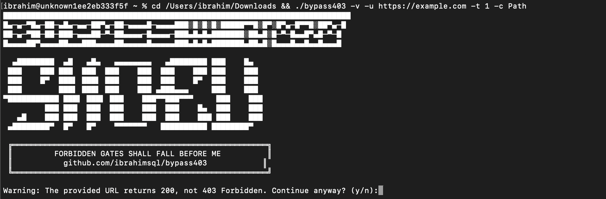

# GoBypass403: Advanced 403 Forbidden Bypass Tool

<h4 align="center">Web Security Testing & Penetration Testing Framework</h4>

<p align="center">
  <a href="#about">📖 About</a> •
  <a href="#features">✨ Features</a> •
  <a href="#installation">🏗️ Installation</a> •
  <a href="#usage">⛏️ Usage</a> •
  <a href="#techniques">🔍 Techniques</a> •
  <a href="#examples">🚀 Examples</a> •
  <a href="#contributing">🤝 Contributing</a> •
  <a href="#resources">📚 Resources</a>
</p>

<p align="center">
  <a href="https://github.com/ibrahimsql/GoBypass403/releases">
    
  </a>
  <a href="https://golang.org/doc/go1.21">
    
  </a>
  <a href="LICENSE">
    
  </a>
  <a href="https://github.com/ibrahimsql/GoBypass403/stargazers">
    
  </a>
  <a href="https://github.com/ibrahimsql/GoBypass403/network/members">
    
  </a>
  <a href="https://github.com/ibrahimsql/GoBypass403/issues">
    
  </a>
</p>

> Advanced tool for bypassing 403 Forbidden responses through multiple techniques including header manipulation, path traversal, IP spoofing, URL encoding and more. Perfect for security professionals, penetration testers, and ethical hackers.

<p align="center">
  
</p>


## 📖 About

`GoBypass403` is a comprehensive security testing tool that attempts to bypass 403 Forbidden HTTP responses by employing a wide range of techniques. It automates many common bypass methods used in web application penetration testing and security assessments, helping security professionals identify vulnerabilities in access control mechanisms.

## ✨ Features for Security Professionals

- **Multiple Bypass Techniques**:
  - Method manipulation (GET, POST, HEAD, OPTIONS, etc.)
  - Path manipulation
  - Header manipulation
  - IP spoofing headers
  - URL encoding bypass
  - Protocol bypass
  - Path traversal
  - Caching proxy bypass
  - Advanced payloads
  - Wordlist-based bypasses
  - Combined techniques

- **Customization for Penetration Testers**:
  - Custom wordlists
  - User-agent customization
  - Category filtering of techniques
  - HTTP timeout settings
  - Concurrent request threads

- **Advanced Security Testing Features**:
  - Random user agent rotation
  - Burp Suite integration
  - CURL and Python command generation for successful bypasses
  - Comprehensive URL mutation techniques

- **Output Options for Security Reports**:
  - Verbose mode
  - Save results to file
  - Automatic saving of successful bypasses

## 🏗️ Security Tool Installation

### Using Go Install (Recommended)

The quickest way to install bypass403 is with Go:

```bash
go install github.com/ibrahimsql/bypass403@latest
```

Make sure your Go bin directory is in your PATH:
```bash
export PATH=$PATH:$(go env GOPATH)/bin
```

### From Source

For the latest development version or if you want to modify the code:

```bash
git clone https://github.com/ibrahimsql/bypass403.git
cd bypass403
go mod tidy  # To ensure all dependencies are correctly installed
go build
```

## ⛏️ Web Security Testing Usage

```
bypass403 -u https://example.com/admin -v -o results.txt
```

### Command Line Options for Security Testing

```
  -u string
        URL that returns 403 Forbidden
  -t int
        Number of concurrent threads (default 10)
  -o string
        Output file to save results
  -timeout int
        HTTP request timeout in seconds (default 10)
  -v    Verbose mode
  -all  Try all bypass techniques
  -c string
        Category of bypass techniques to try (Method, Path, Headers, IP, Encoding, Protocol, Traversal, Proxy, Advanced)
  -ua string
        User-Agent to use (default "Mozilla/5.0 (Windows NT 10.0; Win64; x64) AppleWebKit/537.36 (KHTML, like Gecko) Chrome/91.0.4472.124 Safari/537.36")
  -w string
        Path to wordlist file for bypass attempts (default "payloads/bypasses.txt")
  -version
        Print version information and exit
```

## 🔍 403 Forbidden Bypass Techniques Explained

### Method Manipulation for Access Control Testing
Attempts to access the resource using different HTTP methods.

### Path Manipulation for Bypassing Security Controls
Modifies the URL path using various techniques like path normalization tricks.

### Header Manipulation for Web Security Assessment
Adds custom headers that might affect the server's access control decision.

### IP Spoofing Headers for Penetration Testing
Uses different headers to spoof the client's IP address as localhost or trusted IPs.

### URL Encoding Bypass Techniques
Applies different URL encoding techniques to the path.

### Protocol Bypass for Web Access Controls
Tries different protocols (HTTP/HTTPS) to access the resource.

### Path Traversal Security Testing
Uses directory traversal techniques to bypass restrictions.

### Caching Proxy Bypass Methods
Employs headers that might affect caching behavior of proxy servers.

### Advanced Security Bypass Payloads
Uses complex techniques combining multiple bypass methods.

### Wordlist-based Security Testing
Tests various paths from a wordlist.

### Combined Techniques for Comprehensive Security Assessment
Applies combinations of headers, methods, and path modifications.

## 🚀 Security Testing Examples

### Basic Usage

```bash
bypass403 -u https://example.com/admin
```

### Advanced Security Techniques

Try all techniques with a custom wordlist:
```bash
bypass403 -u https://example.com/admin -w custom_wordlist.txt -all
```

Focus on specific category of techniques:
```bash
bypass403 -u https://example.com/admin -c Headers
```

Increase verbosity and concurrent threads:
```bash
bypass403 -u https://example.com/admin -v -t 20
```

## 🤝 Contributing to Web Security Tools

Contributions are welcome! Feel free to submit pull requests with new bypass techniques or improvements.

## 📚 Related Security Testing Resources

- [OWASP Broken Access Control](https://owasp.org/www-project-top-ten/2017/A5_2017-Broken_Access_Control)
- [Portswigger Web Security Academy](https://portswigger.net/web-security)
- [HackTricks Access Control Bypassing](https://book.hacktricks.xyz/pentesting-web/403-bypass-forbidden)
- [Penetration Testing Resources](https://github.com/wtsxDev/Penetration-Testing-Tools)
- [Bug Bounty Methodology](https://github.com/KathanP19/HowToHunt)

## Developer

<p align="center">
  <a href="https://github.com/ibrahimsql">
    
  </a>
</p>

This powerful security tool was developed by [ibrahimsql](https://github.com/ibrahimsql), a specialized security researcher and penetration tester with expertise in web application security and bypass techniques.

<p align="center">
  <a href="https://github.com/ibrahimsql"></a>

## High-Power Payloads

The payloads included in bypass403 are extremely powerful and have been carefully crafted to bypass even the most sophisticated access control implementations. The tool includes:

- **Advanced Evasion Techniques**: Specifically designed to circumvent modern WAFs and security filters
- **Multi-layered Bypass Methods**: Combining multiple techniques in single requests for maximum effectiveness
- **Context-Aware Mutations**: Intelligently modifying requests based on server behavior
- **Zero-Day Techniques**: Includes several lesser-known and highly effective bypass methods not commonly found in other tools
- **Continuously Updated**: Regular updates with new bypass techniques as they are discovered

This collection of bypass techniques has successfully bypassed security controls in major platforms and has been tested against enterprise-grade security solutions.

## Credits

This web security testing tool was inspired by many bypass techniques collected from the security community.

## Disclaimer

This tool is meant for educational purposes and ethical security testing with proper authorization. Do not use against systems you do not have permission to test. 
